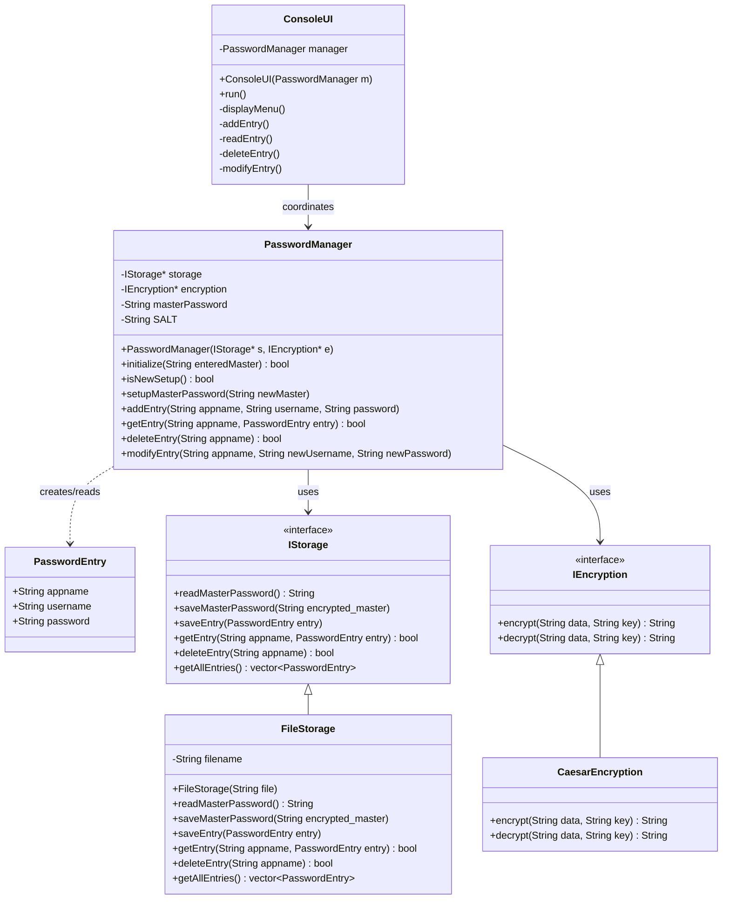

# 🔐 Password Manager - C++ Console Application

## 📋 Overview

This project is a **console-based Password Manager** written in C++. It allows users to securely store, retrieve, modify, and delete login credentials for various applications. The system uses a simple encryption algorithm to protect stored data and enforces access through a master password.

The program was recently refactored to adhere to **SOLID principles**, establishing a robust, testable, and maintainable architecture by decoupling user interface, encryption, data structures, and storage logic.

---

## ⚙️ Features

### ✅ Master Password Protection
* A master password is required to access the system.
* On first use, the program prompts for a new master password and saves an **encrypted** version.
* On subsequent runs, it decrypts the stored master password and compares it with user input.

### ✅ Credential Management
* **Add New Entry**: Input and save credentials (app name, username, password) to a file in encrypted form.
* **View Entry**: Retrieve and decrypt credentials for a specific app name.
* **Modify Entry**: Update credentials by deleting the existing entry and adding a new one.
* **Delete Entry**: Remove a specific app's credentials from the storage file.

### ✅ Data Encryption
* All user credentials are encrypted before being written to the file.
* A simple symmetric encryption method is used where each character is shifted using characters from the master password as the key.

---

## 🏗️ Architecture & Class Diagram

The project is structured according to SOLID principles using interfaces for storage and encryption.



---

## 🗂️ File Structure

* `main.cpp`: Entry point. Wires up dependencies and starts the UI.
* `PasswordEntry.h`: Data Transfer Object (DTO) for password records.
* `IEncryption.h` / `CaesarEncryption.h` / `.cpp`: Encryption interfaces and implementation.
* `IStorage.h` / `FileStorage.h` / `.cpp`: Storage interfaces and implementation.
* `PasswordManager.h` / `.cpp`: Core logic orchestrating encryption and storage.
* `ConsoleUI.h` / `.cpp`: Handles all user interactions (`cin`/`cout`).

---

## 📄 How It Works

1. **Program Start**:
   * The program checks if the storage file (`passwords.txt`) exists and contains data via `FileStorage`.
   * If empty, prompts the user to set a new master password.
   * If not empty, reads the encrypted master password and decrypts it for verification.

2. **Menu Options**:
   After successful authentication, users are presented with the following menu via `ConsoleUI`:
   ```
   1. To Input and Save a new app login (username & password)
   2. To Read and Display stored entries from file
   3. To Delete a specific app entry
   4. To Modify a specific app entry
   ```

3. **Storage**:
   * Entries are stored in `passwords.txt`.
   * The first line contains the encrypted master password.
   * Subsequent lines store encrypted credentials in the format:
     ```
     <encrypted_appname>*<encrypted_username>*<encrypted_password>
     ```

---

## 🛡️ Security Note

This application uses a custom-built, basic encryption method. While suitable for academic and demonstration purposes, **it is not secure for real-world use**.

---

## 🚀 How to Run

1. **Compile the Code**:
   Use any C++ compiler such as `g++`. For example, in Command Prompt:
   ```cmd
   g++ main.cpp CaesarEncryption.cpp FileStorage.cpp PasswordManager.cpp ConsoleUI.cpp -o password_manager.exe
   ```

2. **Run the Executable**:
   ```cmd
   password_manager.exe
   ```
   
   *(In PowerShell, run `.\password_manager.exe`)*

---

## 👨‍💻 Author

Developed by Kaushal N, Krishna Kailash Yedida, Sanjay C, Rangesh V S, as part of a project on file handling and object-oriented programming in C++.
